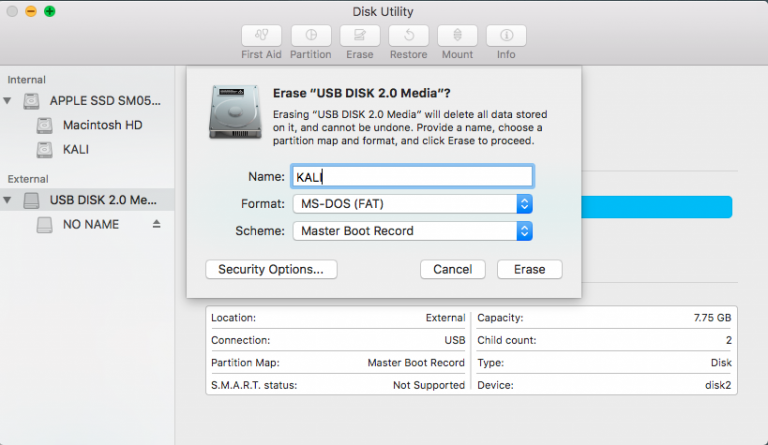
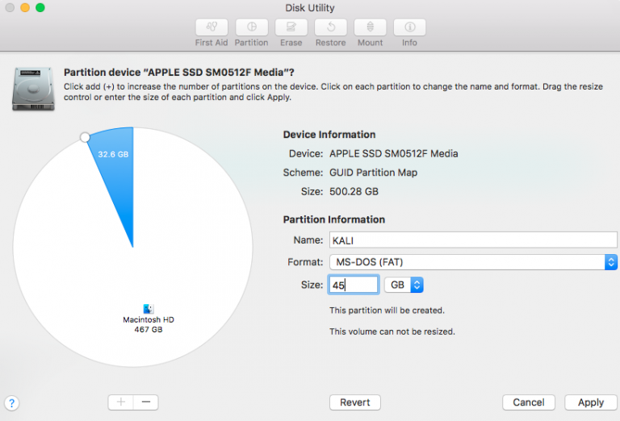
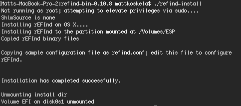

I typically do my development or hacking in a Linux virtual machine on my mac (using VMware Fusion), but some applications require a native Linux install to behave nominally.

Things like running bluetooth sniffers or injecting bluetooth packets with the Ubertooth One on a VM caused USB throughput issues and request timeouts (which I experienced when first setting up my Ubertooth).

Rather than run a separate laptop for these applications, I’ve decided to partition my Mac’s hard drive and dual boot OSX and Kali Linux.  Kali’s website has documentation on this process here.

## Format USB Drive

The first step in getting Kali installed is to prep your USB thumb drive.  It needs to be at least 4GB formatted with a FAT partition.

**Steps**

1. Insert your USB Key
2. Open Disk Utility and Select your External USB Disk (Under External in the left menu)
3. Erase Disk with the following options:
  - Name: KALI (or whatever you want)
  - Format: MS-DOS (FAT)
  - Scheme: Master Boot Record

Take note of Device name (disks in my case).

## Partition Hard Drive

You really need to back everything up before doing this.  Seriously.  Back it up.

**Steps**

1. Click your internal hard drive where OSX is installed.
2. Click Partition
3. Click “+” button to add a partition and use the following parameters:
  - Name: KALI (or whatever you want)
  - Format: MS-DOS (FAT)
  - Size: 45 GB (or any number > 20)

### Troubleshooting

If you are having trouble formatting your hard drive with MacOS High Sierra, read this StackOverflow Post.

## Setup USB Drive

Next we need to turn our USB flash drive into an actual bootable USB Kali drive.

**Steps**

1. Find the latest stable Kali ISO here.  You’re probably looking for the standard Kali 64bit ISO file, which should be the first option.
2. Verify the authenticity of the ISO by following the instructions near the bottom of the Kali Download page.
3. Write image to disk (Triple check the disc2 number – if you put the wrong device name here, you can do some major damage to your system. Also, the dd command could run for 20 minutes or more depending on your system.)

    diskutil unmountDisk /dev/disc2
    sudo dd if=kali-linux-2017.1-amd64.iso of=/dev/disk2 bs=1m

When it’s done, you should see something like this:

    2664+1 records in
    2664+1 records out
    2794307584 bytes transferred in 2181.167580 secs (1281106 bytes/sec)

### Troubleshooting

If you are unable to unmount the disk, you can try using the Disk Utility GUI instead.

If you are getting this error:

    dd: /dev/disc2: Operation not permitted

[You need to follow the instructions here and disable SIP](https://stackoverflow.com/questions/32659348/operation-not-permitted-when-on-root-el-capitan-rootless-disabled).

Reboot your mac and press ⌘+R when booting up. Then go into Utilities > Terminal and type the following commands:

    csrutil disable
    reboot

Re-enable SIP once you complete the USB creation process.

## Install rEFInd on OSX

rEFInd allows us to use OSX’s bootloader to choose which OS to boot into, which makes for a convenient, clean install.

**Steps**

1. [Find the latest version of rEFInd here](https://sourceforge.net/projects/refind/files/) (0.11.2 at time of writing)
2. Download

    curl -s -L http://sourceforge.net/projects/refind/files/0.11.2/refind-bin-0.11.2.zip -o refind.zip

3. After downloading rEFInd, extract the contents of the zip file and run the install shell script.

    unzip -q refind.zip
    cd refind-bin-0.11.2/
    ./refind-install
 

## Install Kali

Reboot into __ by restarting and holding “Option” key.

Select the “Windows” option and continue to install Kali to the new Kali partition you created earlier.  You may need to split it up into a swap and root partition if the Guided Partition option doesn’t work.

Don’t install the GRUB bootloader.  The Kali installer may not recognize the OSX install, and the GRUB bootloader will make OSX unbootable (although this can be undone).  You will use Refind as your bootloader.

### Configure Network Card

Now you can boot into both OSX and Kali, but depending on which Mac you’re using, you probably ran into problems configuring the network card on the Kali install (specifically if your Mac is using the Broadcom BCM4360 network card).

I have this USB wireless card and love it.  It’s easy to flip into promiscuous mode and the drivers are already available in Kali, so I just use this, but I’ve seen posts online on how to get the native mac/broadcom chip working.  I guess I’ll have to come back to this part 🙂

## Additional Reading

- [Kali Documentation](http://docs.kali.org/installation/kali-linux-dual-boot-on-mac-hardware)