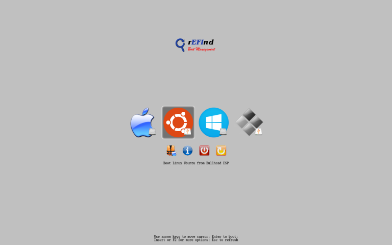
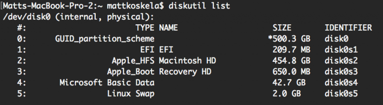
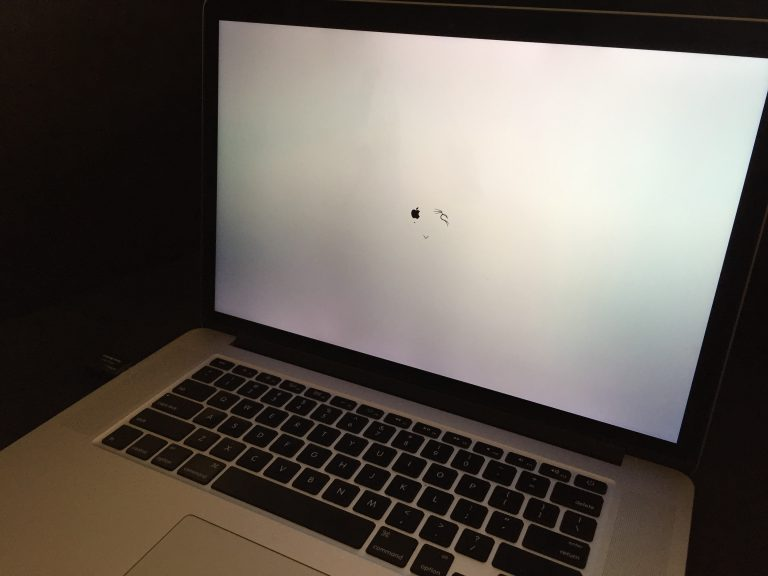

If you’ve used rEFInd to dual boot, you were probably super underwhelmed by the default theme.

If you’re dual booting with any self-respect you’ll want to clean this theme up a bit, and fortunately some amazing themes already exist out there.

Evan Purkhiser has an awesome one here: https://github.com/EvanPurkhiser/rEFInd-minimal

# Find Your rEFInd Install

To install the theme on a Mac, you need to mount the EFI volume to access the rEFInd files.

To find your EFI volume, run:

    diskutil list

In my case the EFI is located at disk0s1.

Create a mount point

    sudo mkdir /Volumes/efi

Mount the Volume:

    sudo mount -t msdos /dev/disk0s1 /Volumes/esp
 
# Install the Theme

Then you can just use Finder to navigate to `/Volumes/efi/EFI/refind/`

Make a directory called `themes`.

Copy theme into themes directory.

Add the following line to refind.conf:

    include themes/rEFInd-minimal/theme.conf

Reboot and enjoy the new theme!

[You can read more about finding the rEFInd install on AskUbuntu here](https://askubuntu.com/questions/468483/where-can-i-find-the-refind-conf-configuration-file).

# Themes

https://github.com/EvanPurkhiser/rEFInd-minimal
https://github.com/lukechilds/refind-ambience
https://github.com/munlik/refind-theme-regular